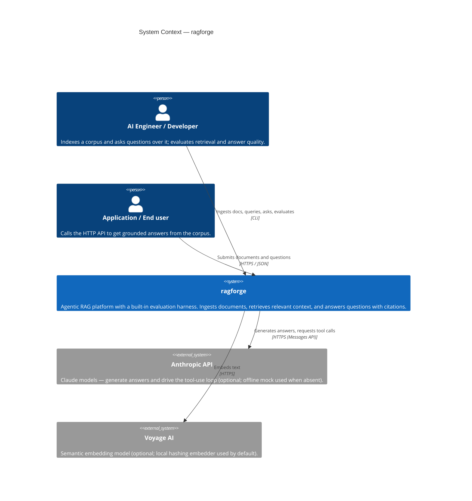

# C4 Level 1 — System Context

The context diagram shows ragforge as a single black box, the people who use it,
and the external systems it depends on.

## Actors

- **AI Engineer / Developer** — the primary user. Builds an index from a corpus,
  runs queries and agent-backed `ask` sessions, and uses the evaluation harness
  to measure quality while iterating.
- **Application / End user** — any client that consumes the HTTP API to ingest
  documents and ask questions, embedding ragforge into a larger product.

## External dependencies

- **Anthropic API (optional).** When `ANTHROPIC_API_KEY` is set, the agent calls
  Claude (default `claude-opus-4-8`, adaptive thinking + effort) to answer and to
  decide when to invoke the `search_corpus` tool. Without a key, a deterministic
  offline mock drives the identical loop, so the system is fully functional and
  testable with no third-party calls.
- **Voyage AI (optional).** Selectable as the embedding provider for
  production-quality semantic vectors. The default is a local, deterministic
  hashing embedder that requires no network or key.

## Boundaries & trust

The only data leaving the process is (a) text sent to Anthropic for answer
generation and (b) text sent to Voyage for embedding — both only when explicitly
configured. API keys are read from the environment by the respective SDKs and are
never logged or persisted by ragforge.
