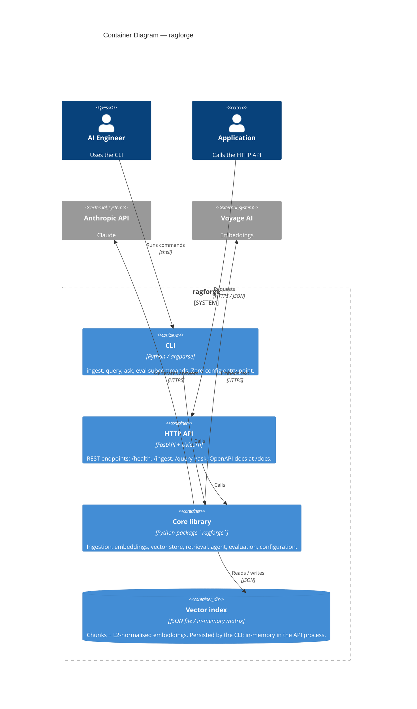

# C4 Level 2 — Containers

A "container" in C4 is a separately runnable or deployable unit (an application,
a service, a data store) — not a Docker container specifically. ragforge is a
single-node system with two entry points (CLI and HTTP API) over one shared
library core, plus a persisted index.

## Containers

### CLI (`ragforge.cli`)
A thin argparse front end with four subcommands:

| Command  | Action |
| -------- | ------ |
| `ingest` | Load a file/directory, chunk + embed, write a JSON index. |
| `query`  | Embed a query and print the top-k chunks from an index. |
| `ask`    | Run the agent over an index; answer with citations. |
| `eval`   | Score retrieval + answers for a dataset, print/emit a report. |

It depends only on the core and works with no configuration or API key.

### HTTP API (`ragforge.api`)
A FastAPI application (`create_app` factory + module-level `app` for Uvicorn). It
holds one `Pipeline` and one agent in application state, so an index built via
`/ingest` persists across requests within the process. Pydantic models define the
request/response contract; OpenAPI/Swagger is served at `/docs`. Ships with a
multi-stage `Dockerfile` (non-root runtime, healthcheck).

### Core library (`ragforge`)
The reusable heart of the system — see the [component diagram](03-component.md).
Both entry points are deliberately thin shells over this package.

### Vector index (data)
Chunks and their embeddings. In the API it lives in memory as a NumPy matrix; the
CLI persists it as a single human-readable JSON file. The format is intentionally
simple and portable; the seam for swapping in an external vector database is the
`VectorStore` protocol.

## Runtime topology

Today everything runs in a single process (one CLI invocation, or one API
worker). The design marks two clear scale-out seams: the `VectorStore` protocol
(swap the in-memory store for a dedicated vector DB) and the `Embedder` protocol
(swap local hashing for a hosted embedding service).
