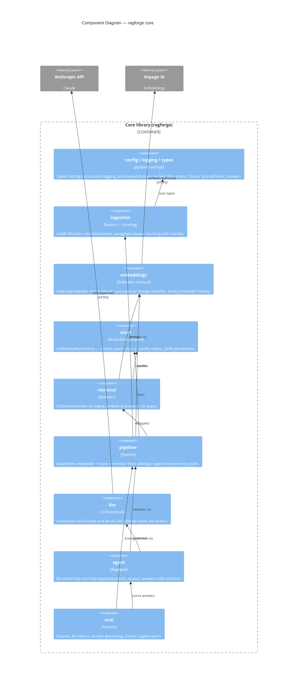

# C4 Level 3 — Components

This zooms into the **Core library** container and shows its major components
(Python modules/packages) and their dependencies. Arrows point from a component
to the components it uses.

## Component responsibilities

| Component | Module(s) | Responsibility |
| --------- | --------- | -------------- |
| **Config / logging / types** | `config.py`, `logging.py`, `types.py` | One typed view of configuration; consistent logging; the domain models (`Document`, `Chunk`, `ScoredChunk`, `Answer`) that flow between components. |
| **Ingestion** | `ingestion/loaders.py`, `ingestion/chunking.py` | Turn raw text/files into `Document`s; split into overlapping, paragraph-aware `Chunk`s. |
| **Embeddings** | `embeddings/base.py`, `hashing.py`, `__init__.build_embedder` | `Embedder` protocol; local deterministic `HashingEmbedder`; optional Voyage provider, chosen by config. |
| **Store** | `store/base.py`, `store/memory.py` | `VectorStore` protocol; `InMemoryVectorStore` doing cosine search over a NumPy matrix with JSON persistence. |
| **Retrieval** | `retrieval/retriever.py` | Bind an embedder to a store: embed-and-index, embed-and-search. |
| **Pipeline** | `pipeline.py` | Assemble components from `Settings`; the high-level ingest/retrieve facade (`Pipeline`, `Pipeline.from_index`). |
| **LLM** | `llm/base.py`, `anthropic_client.py`, `mock.py`, `build_llm` | Provider-agnostic `LLM` contract; Claude adapter; deterministic offline mock; factory that picks live-vs-mock by key presence. |
| **Agent** | `agent/rag_agent.py` | The agentic loop: expose `search_corpus`, let the model decide when to search, collect evidence, answer with citations. |
| **Eval** | `eval/*` | Dataset format, retrieval metrics, answer grounding, runner, typed report. |

## Key design seams

- **`Embedder`** and **`VectorStore`** are `Protocol`s — the retriever and
  pipeline depend on the interface, not a concrete class. Swapping providers is a
  config change, not a code change.
- **`LLM`** is likewise a protocol; `AnthropicLLM` and `MockLLM` are
  interchangeable, which is what makes the agent loop testable offline.
- The **agent depends on the `Pipeline`** for retrieval and on an `LLM` for
  generation — it never touches embedders or stores directly.
