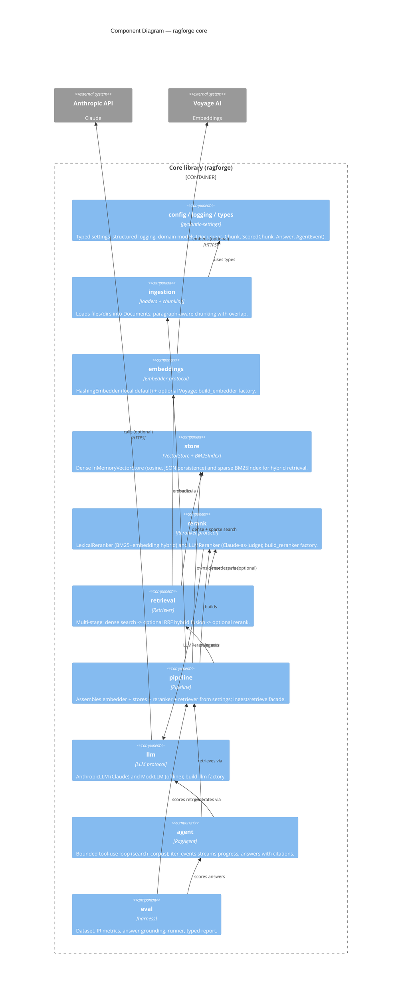

# C4 Level 3 — Components

This zooms into the **Core library** container and shows its major components
(Python modules/packages) and their dependencies. Arrows point from a component
to the components it uses.

## Component responsibilities

| Component | Module(s) | Responsibility |
| --------- | --------- | -------------- |
| **Config / logging / types** | `config.py`, `logging.py`, `types.py` | One typed view of configuration; consistent logging; the domain models (`Document`, `Chunk`, `ScoredChunk`, `Answer`) that flow between components. |
| **Ingestion** | `ingestion/loaders.py`, `ingestion/chunking.py` | Turn raw text/files into `Document`s; split into overlapping, paragraph-aware `Chunk`s. |
| **Embeddings** | `embeddings/base.py`, `hashing.py`, `__init__.build_embedder` | `Embedder` protocol; local deterministic `HashingEmbedder`; optional Voyage provider, chosen by config. |
| **Store** | `store/base.py`, `store/memory.py`, `store/sparse.py` | `VectorStore` protocol + dense `InMemoryVectorStore` (cosine, JSON persistence) and sparse `BM25Index` for hybrid retrieval. |
| **Rerank** | `rerank/base.py`, `lexical.py`, `llm_reranker.py`, `build_reranker` | `Reranker` protocol; `LexicalReranker` (BM25+embedding hybrid) and `LLMReranker` (Claude-as-judge); factory chosen by config. |
| **Retrieval** | `retrieval/retriever.py` | Multi-stage: dense embedding search → optional RRF hybrid fusion with the sparse index → optional rerank. |
| **Pipeline** | `pipeline.py` | Assemble components from `Settings`; the high-level ingest/retrieve facade (`Pipeline`, `Pipeline.from_index`). |
| **LLM** | `llm/base.py`, `anthropic_client.py`, `mock.py`, `build_llm` | Provider-agnostic `LLM` contract; Claude adapter; deterministic offline mock; factory that picks live-vs-mock by key presence. |
| **Agent** | `agent/rag_agent.py` | The agentic loop: expose `search_corpus`, let the model decide when to search, collect evidence, answer with citations. `iter_events` streams progress; `answer` drains it. |
| **Eval** | `eval/*` | Dataset format, retrieval metrics, answer grounding, runner, typed report. |

## Key design seams

- **`Embedder`**, **`VectorStore`**, **`Reranker`**, and **`LLM`** are all
  `Protocol`s — components depend on the interface, not a concrete class. Swapping
  any provider (embedder, store, reranker strategy, LLM) is a config change, not
  a code change.
- **`AnthropicLLM` / `MockLLM`** are interchangeable, which is what makes the
  agent loop and the `LLMReranker` testable offline and deterministically.
- **Retrieval composes optional stages** (dense → hybrid fuse → rerank) behind one
  `Retriever.retrieve` call, so callers are oblivious to how many stages run.
- The **agent depends only on the `Pipeline`** for retrieval and an `LLM` for
  generation — it never touches embedders, stores, or rerankers directly.
