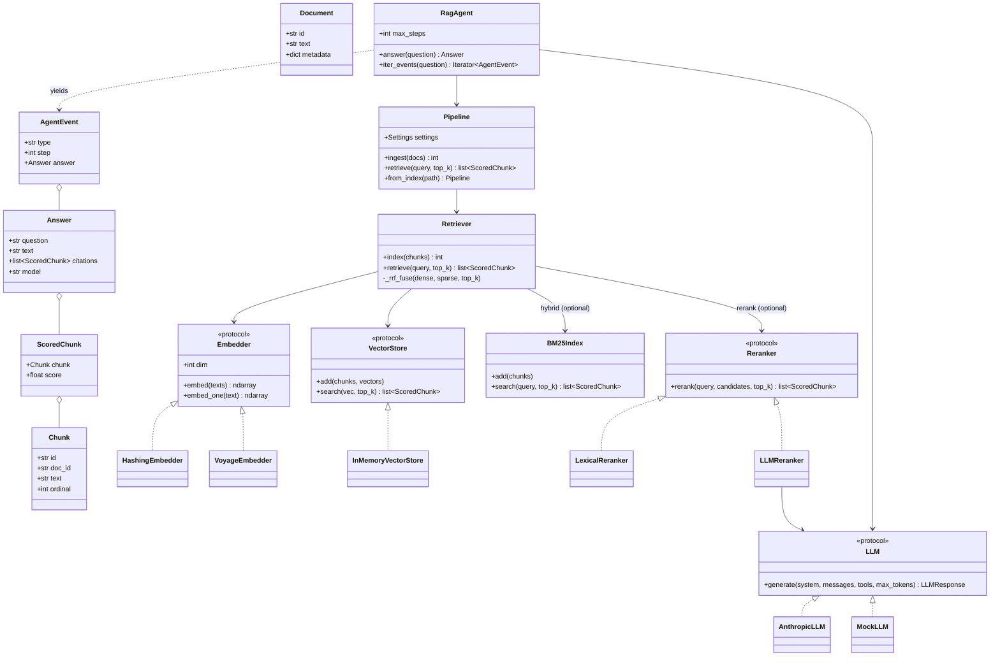
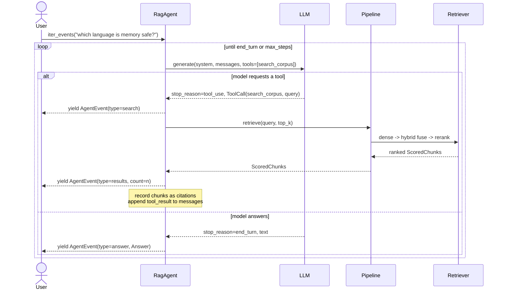

# C4 Level 4 — Code

The lowest C4 level shows how the key abstractions are modelled in code. Two
views are most illustrative: the **class relationships** around the agent, and
the **sequence** of the tool-use loop.

## Class diagram — core abstractions

## Sequence diagram — the agentic tool-use loop

`RagAgent.iter_events()` runs a bounded loop and *yields* progress events; the
model is offered a `search_corpus` tool and decides when to use it. The agent
executes searches (each a full dense→hybrid→rerank retrieve), feeds results back,
and collects every retrieved chunk as evidence. `answer()` simply drains this
generator and returns the terminal event's `Answer`; the SSE endpoint and
`ask --stream` forward the events themselves.

## Why these shapes

- **Protocols over base classes.** `Embedder`, `VectorStore`, `Reranker`, and
  `LLM` are `typing.Protocol`s. Concrete types are structurally compatible without
  inheritance, which keeps providers decoupled and trivially mockable.
- **Retrieval is staged, not branched at call sites.** `Retriever.retrieve`
  internally runs dense search, optional RRF fusion with the `BM25Index`, and an
  optional `Reranker` — callers (agent, CLI, API) see one method whatever the
  configured depth.
- **One streaming loop, three consumers.** `iter_events` is the single loop;
  `answer()`, the SSE endpoint, and `ask --stream` are all thin consumers of it,
  so behaviour can't drift between them.
- **`LLMResponse.wants_tools`** centralises the "should I run tools?" decision
  (`stop_reason == "tool_use"` and at least one call), so the agent loop reads
  declaratively.
- **Reconstructed assistant turns.** The agent rebuilds the assistant message
  (text + `tool_use` blocks) and the following `tool_result` user message in the
  Anthropic content-block shape, so the *same* loop drives both the live client
  and the offline mock with no special-casing.
- **Evidence is accumulated, not just last-search.** Chunks from every search in
  the loop are merged (keeping the best score per chunk) and returned sorted, so
  the `Answer.citations` reflect everything the answer could draw on.
